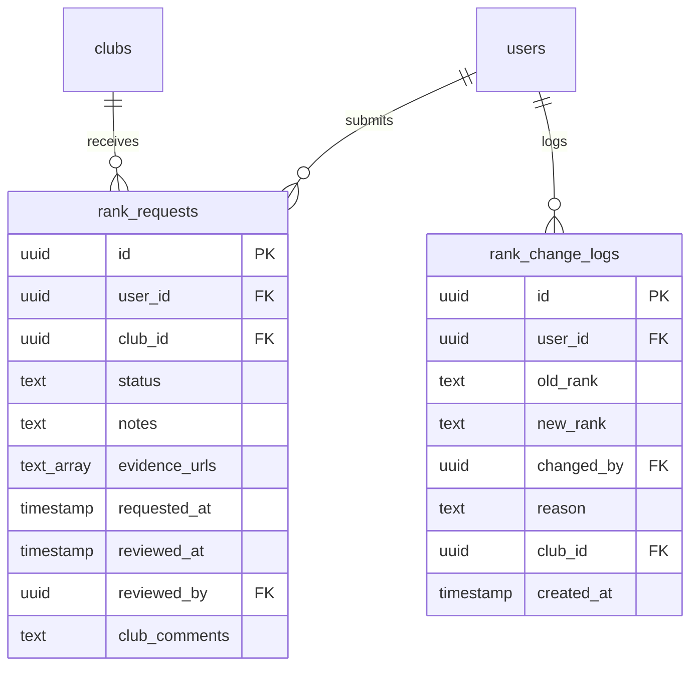

# 🚀 HỆ THỐNG ĐĂNG KÝ HẠNG VỚI BẰNG CHỨNG HÌNH ẢNH

## ✅ ĐÃ TRIỂN KHAI HOÀN THÀNH

### 📋 Tổng quan tính năng
- ✅ **Form đăng ký hạng mới** với tự đánh giá và upload hình ảnh bằng chứng
- ✅ **Backend xử lý** upload ảnh lên Supabase Storage
- ✅ **Hệ thống duyệt** cho club admin với UI hoàn chỉnh
- ✅ **Database schema** với bảng rank_requests và evidence_urls
- ✅ **RPC functions** để xử lý toàn bộ flow approval

---

## 🗂️ CÁC FILE ĐÃ TẠO/CẬP NHẬT

### 1. **Frontend Enhancement**
📂 `lib/screens/user/rank_registration_screen.dart`
- ✅ Thêm dropdown tự đánh giá hạng (K → E+) 
- ✅ Image picker với preview grid
- ✅ Upload progress indicators
- ✅ Integration với UserService

### 2. **Backend Service**  
📂 `lib/services/user_service.dart`
- ✅ Method `uploadImage()` lên Supabase Storage
- ✅ Update `requestRankRegistration()` với evidenceUrls
- ✅ Error handling và progress feedback

### 3. **Database Migrations**
📂 `rank_requests_migration.sql`
```sql
-- Tạo bảng rank_requests với evidence_urls
CREATE TABLE rank_requests (
    id UUID PRIMARY KEY DEFAULT gen_random_uuid(),
    user_id UUID REFERENCES users(id),
    club_id UUID REFERENCES clubs(id),
    status TEXT DEFAULT 'pending',
    notes TEXT,
    evidence_urls TEXT[],  -- Lưu array các links hình ảnh
    requested_at TIMESTAMP DEFAULT NOW(),
    reviewed_at TIMESTAMP,
    reviewed_by UUID REFERENCES users(id),
    club_comments TEXT
);
```

📂 `rank_registration_functions.sql`
```sql
-- RPC Functions đã tạo:
- get_pending_rank_change_requests() 
- club_review_rank_change_request(request_id, approved, comments)
- get_user_rank_history(user_id)
- Bảng rank_change_logs để log lịch sử thay đổi
```

### 4. **Admin UI (Đã có sẵn)**
📂 `lib/screens/club/club_rank_change_management_screen.dart`
- ✅ Hiển thị danh sách pending requests
- ✅ Preview hình ảnh evidence trong grid
- ✅ Buttons Approve/Reject với comments
- ✅ Integration với RPC functions

---

## 🔧 CẦN THỰC HIỆN THỦ CÔNG

### ⚠️ **QUAN TRỌNG: Chạy Database Migrations**

Bạn cần chạy **2 file SQL** trong Supabase Dashboard:

1. **Mở Supabase Dashboard** → Project → SQL Editor
2. **Copy và execute** nội dung file `rank_requests_migration.sql` 
3. **Copy và execute** nội dung file `rank_registration_functions.sql`

### 📁 **Tạo Storage Bucket** 
Trong Supabase Dashboard → Storage:
```sql
-- Tạo bucket cho evidence images
INSERT INTO storage.buckets (id, name, public) 
VALUES ('user-images', 'user-images', true);

-- Set policy cho bucket
CREATE POLICY "Allow public read" ON storage.objects 
FOR SELECT USING (bucket_id = 'user-images');

CREATE POLICY "Allow authenticated upload" ON storage.objects 
FOR INSERT WITH CHECK (
    bucket_id = 'user-images' 
    AND auth.role() = 'authenticated'
);
```

---

## 🧪 TESTING WORKFLOW

### 📱 **Flow 1: User đăng ký hạng**
1. Vào app → Profile → "Đăng ký thay đổi hạng" 
2. Chọn hạng mong muốn từ dropdown
3. Nhập ghi chú và chọn 1-5 hình ảnh bằng chứng
4. Submit → Kiểm tra upload thành công

### 👨‍💼 **Flow 2: Admin duyệt đơn**  
1. Login với tài khoản admin/club owner
2. Vào Club Management → "Rank Change Requests"
3. Xem danh sách pending requests
4. Click vào request để xem evidence images
5. Approve/Reject với comment

### ✅ **Flow 3: Verification**
1. Kiểm tra rank user được cập nhật
2. Xem rank_change_logs trong database
3. Test notification system (nếu có)

---

## 🔍 DEBUG TIPS

### 🐛 **Nếu upload ảnh fail:**
```dart
// Check file size limit trong UserService
if (file.lengthSync() > 5 * 1024 * 1024) {
  throw 'File quá lớn (max 5MB)';
}
```

### 🐛 **Nếu admin không thấy requests:**
```sql
-- Check RLS policies
SELECT * FROM rank_requests WHERE status = 'pending';

-- Verify admin role
SELECT * FROM users WHERE role IN ('admin', 'club_admin');
```

### 🐛 **Nếu RPC functions fail:**
```sql
-- Test functions manually
SELECT get_pending_rank_change_requests();
SELECT club_review_rank_change_request('request-id', true, 'Approved');
```

---

## 📊 DATABASE SCHEMA OVERVIEW



---

## 🎯 NEXT STEPS

1. **Chạy migrations** trong Supabase
2. **Test app** với real data
3. **Kiểm tra storage** có upload được không
4. **Verify approval flow** hoạt động end-to-end
5. **Add notifications** (optional) khi request được duyệt

---

## 🏆 FEATURES COMPLETED

✅ **Self-assessment ranking dropdown**  
✅ **Multiple evidence image upload**  
✅ **Progress indicators during upload**  
✅ **Admin review interface với evidence preview**  
✅ **Complete approval workflow với database logging**  
✅ **RPC functions cho all operations**  
✅ **Error handling và validation**  

🚀 **System ready for production testing!**